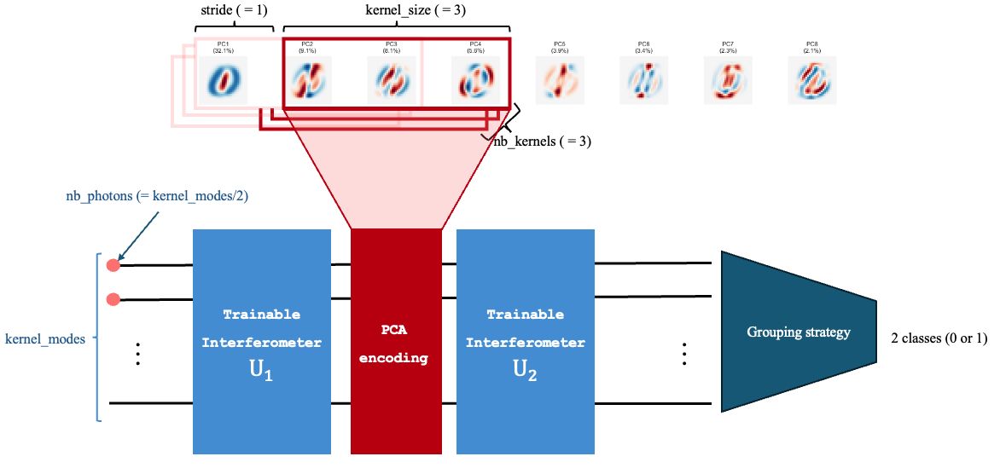
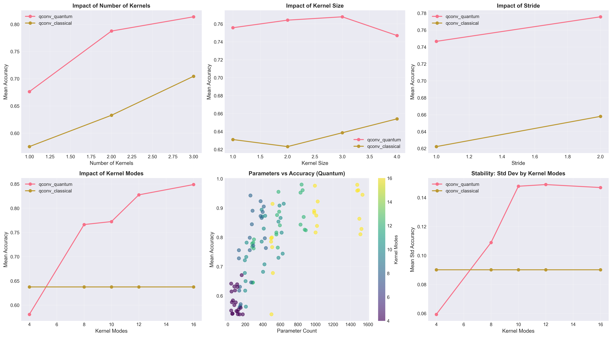
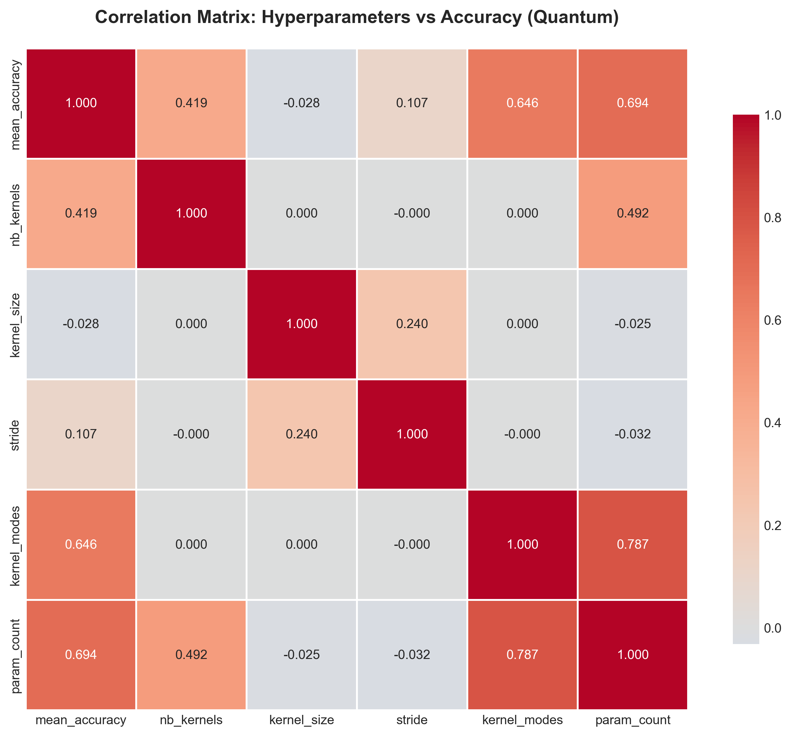
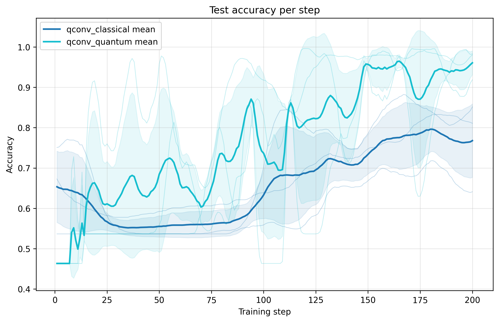
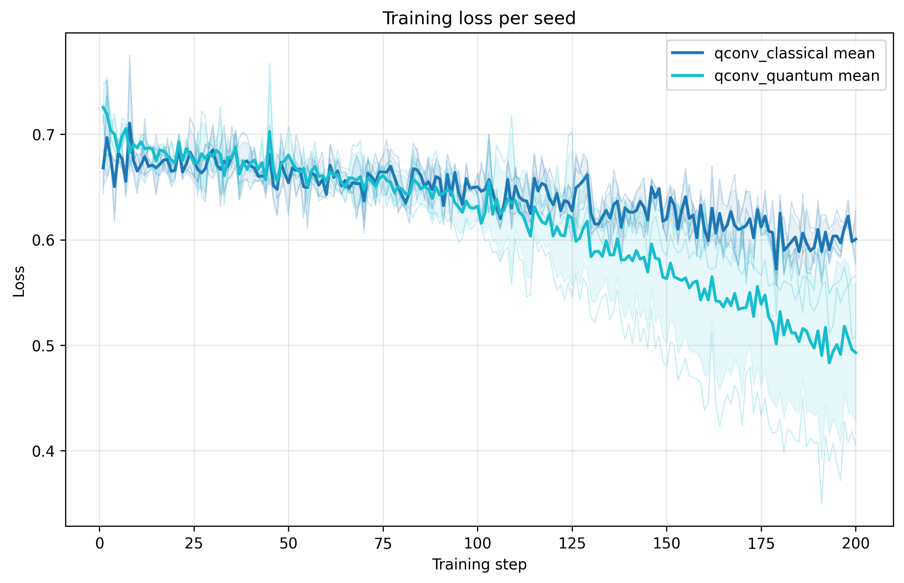
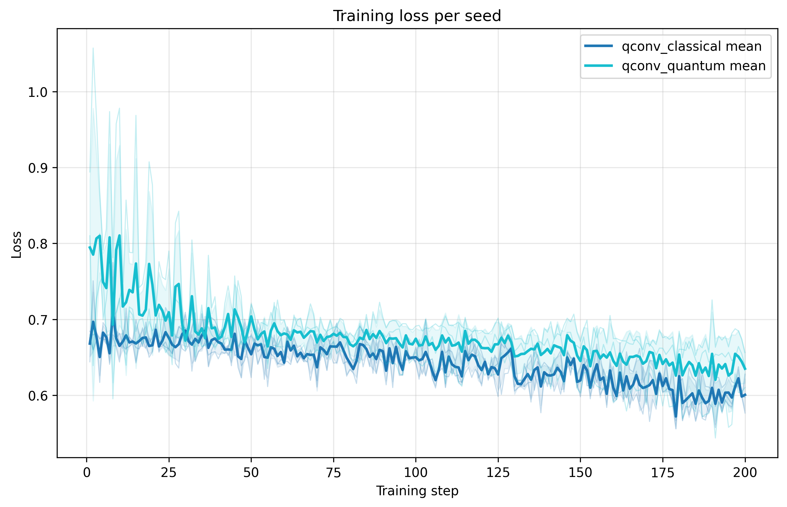

# QCNN Data Classification — Reproduction Notes

## Reference and Attribution

- Paper: *Quantum convolutional neural network for classical data classification*
- Authors: Tak Hur, Leeseok Kim, Daniel K. Park
- ArXiv: [arXiv:2108.00661](https://arxiv.org/abs/2108.00661)
- Original repository: https://github.com/takh04/QCNN

## Overview

This folder contains two complementary workflows:

1. **Merlin/Perceval reproduction** — a PyTorch implementation of the parallel-columns photonic QCNN using Merlin's `QuantumLayer`. It operates on PCA-compressed MNIST-family digits (0 vs 1) and supports both quantum pseudo-convolutions and aligned classical baselines.
2. **Original QCNN wrappers** — lightweight utilities that invoke the authors' TensorFlow/Keras code so we can benchmark the same ansätze and encodings.

The repository keeps the standard template layout:

```
QCNN_data_classification/
├── configs/      # Ready-to-run JSON presets
├── data/         # Cached datasets or PCA artefacts
├── lib/          # Legacy scripts (e.g., reference Merlin reproduction)
├── model/        # Source modules (QConvModel, SingleGI, helpers, …)
├── models/       # Saved checkpoints
├── results*/     # Result folders per dataset (created at runtime)
├── tests/        # Smoke tests
├── utils/        # Helper scripts and QCNN wrappers
├── implementation.py   # Thin wrapper delegating to the repo-wide CLI
├── notebook.ipynb      # Exploratory scratchpad
└── requirements.txt    # Minimal dependencies
```

## How to Run

### Install dependencies

```bash
cd QCNN_data_classification
python -m venv .venv
source .venv/bin/activate
pip install -r requirements.txt
```

### Command-line interface

The project runs through the repository-level CLI located one directory up. While you stay inside `QCNN_data_classification/`, call it via `../implementation.py` and select this project with `--project QCNN_data_classification`:

```bash
python ../implementation.py --project QCNN_data_classification --help
```
You can either run a simple QNN model using `--model single` or a quantum convolution network using `--model qconv`. This will implement the following model:



Key options to run these models (see `configs/cli.json`, `model/`, and `utils/` for the full list):

- `--model {qconv,single}` switch between the quantum pseudo-convolution and a single Gaussian interferometer baseline.
- `--nb_kernels`, `--kernel_size`, `--stride`, `--kernel_modes`: quantum kernel topology.
- `--amplitude`: enable amplitude encoding in the quantum kernels.
- `--compare_classical`: train/evaluate quantum and classical pseudo-convolutions with identical receptive fields.
- `--conv_classical`: skip the quantum branch entirely (classical convolution only).
- `--n_modes`, `--n_features`, `--n_photons`, `--reservoir_mode`, `--state_pattern`: single-GI/photonic circuit settings.
- `--angle_scale`, `--steps`, `--batch`, `--seeds`, `--opt`, `--lr`, `--momentum`: optimisation knobs.
- `--config PATH`: load parameters from JSON; CLI flags override the file.

Example quantum run:

```bash
python ../implementation.py --project QCNN_data_classification \
  --dataset mnist \
  --pca_dim 8 \
  --steps 200 \
  --seeds 3 \
  --nb_kernels 4 \
  --kernel_size 2 \
  --kernel_modes 8 \
  --compare_classical
```

Single-GI baseline:

```bash
python ../implementation.py --project QCNN_data_classification \
  --model single \
  --n_modes 8 --n_features 8 \
  --n_photons 4 \
  --steps 200 --seeds 3
```

From JSON:

```bash
python ../implementation.py --project QCNN_data_classification --config configs/example.json
```

### Original QCNN wrappers

Utilities that drive the official QCNN repo live in `utils/`:

- `utils/run_experiment.py`: multi-seed runner for `QCNN/Benchmarking.py`.
- `utils/run_exp.sh`: example sweep mirroring the paper's ansätze.

Clone the upstream QCNN source under `QCNN_data_classification/QCNN/` (or add it to `PYTHONPATH`) before running:

```bash
python utils/run_experiment.py --dataset mnist --classes 0,1 --ansatz 7 --encoding pca8
```

Results are stored in the upstream `QCNN/Result/` tree.

## Output Directory and Artifacts

The Merlin CLI writes dataset-specific folders such as `results/results-mnist/` or `results/results-fashionmnist/`. Each run creates a timestamped subdirectory:

```
results/results-<dataset>/run_YYYYMMDD-HHMMSS/
├── config_snapshot.json   # Fully resolved CLI/config arguments
├── run_summary.json       # Aggregated metrics (per seed and variant)
└── checkpoints / figures  # Optional artefacts produced by the run
```

Add `--figures` to store training curves, and use `--compare_classical` to generate both quantum/classical metrics in the same folder.

## Configuration

Drop JSON configs into `configs/`. `configs/example.json` documents the supported keys (dataset, PCA dimension, quantum kernel parameters, optimisation settings, logging toggles, etc.). You can mix and match CLI overrides with JSON files to create reproducible experiment manifests.

## Results and Analysis

We explored the MNIST 0-vs-1 task with 8 PCA components. Hyperparameter sweeps (outputs under `plots-mnist/outputs/`) were summarised into the figures below (stored in `plots-mnist/plots/`):

| | |
| --- | --- |
|  |  |
|  |  |

Highlights (see `plots-mnist/outputs/full_analysis_with_efficiency.csv` and `top_20_configurations.csv` for numbers):

- **Kernel modes** drive accuracy the most (correlation ≈0.65). Increasing modes from 4 to 16 boosts mean accuracy from 0.58 to 0.85 but raises parameter counts from ~90 to ~1,000.
- **Number of kernels**: three kernels deliver ≈0.81 mean accuracy vs 0.68 with one, at the cost of ~700 parameters.
- **Kernel size**: receptive fields of 2–3 outperform size 1 by ~1% absolute accuracy; size 4 over-smooths (≈0.75 mean accuracy).
- **Stride**: stride 2 slightly outperforms stride 1 (0.776 vs 0.747 mean accuracy) while trimming parameters because fewer overlapping patches are evaluated.
- **Parameter trade-offs**: the best MNIST configuration (3 kernels, size 2, stride 2, 12 modes) reaches 0.98 ± 0.015 accuracy with ~840 parameters. Classical baselines remain more parameter-efficient (≈0.65 accuracy with 13 params) but cap out in absolute accuracy.

Use these guidelines to pick QCNN settings that fit your hardware budget: start with 12 kernel modes, 3 kernels, kernel size 2–3, stride 2, and tune down as required.

### Results
Here, we use 12 kernel modes, 3 kernels, and a kernel size of 3 and a stride of 2 and angle encoding.

- Quantum convolution (830 trainable parameters)

|  | 8 PCA components | 16 PCA components |
| ----------- | ----------- | ----------- |
| MNIST | 96.08 ± 3.64 | 80.11 ± 23.29 |
| FashionMNIST | 93.18% ± 1.20% | 82.75 ± 19.07 |

- Classical convolution (32 trainable parameters)

|  | 8 PCA components | 16 PCA components |
| ----------- | ----------- | ----------- |
| MNIST | 76.78 ± 11.16 | 72.84 ± 15.04 |
| FashionMNIST | 81.35% ± 6.38% | 76.85 ± 23.14 |

Below, you can observe the training losses and accuracies for trainings done on 8 PCA components for MNIST then FashionMNIST

| | |
| --- | --- |
|  |  |
|  |  |

Here, we use 6 kernel modes, 3 kernels, and a kernel size of 3 and a stride of 2 with amplitude encoding
- Quantum convolution (128 and 176 parameters)

|  | 8 PCA components | 16 PCA components |
| ----------- | ----------- | ----------- |
| MNIST | 73.51 ± 14.07 | 66.89 ± 12.08 |
| FashionMNIST | 71.48 ± 12.53 | 74.13 ± 21.65 |

We can observe the training curves for trainings done on 8 PCA components for MNIST and FashionMNIST
| | |
| --- | --- |
|  |  |
|  |  |

|  | 8 PCA components | 16 PCA components |
| ----------- | ----------- | ----------- |
| MNIST | 73.51 ± 14.07 | 66.89 ± 12.08 |
| FashionMNIST | 71.48 ± 12.53 | 74.13 ± 21.65 |

## Extensions and Next Steps

- Explore amplitude-encoding kernels via `--amplitudes` to evaluate the different computation spaces.
- Integrate checkpoint saving in `models/` for fine-tuning or transfer experiments.

## Reproducibility Notes

- Control randomness via `--seeds`; `train_once` sets deterministic PyTorch seeds per run.
- Merlin/Perceval versions are pinned in `requirements.txt`; capture exact environments with `pip freeze > results/results-*/requirements.txt`.
- Keep PCA preprocessing consistent (`data/make_pca` handles caching).
- Virtual environments (`.venv/`) can live at repo root; git ignores them by default.

## Testing

Run smoke tests from the QCNN root:

```bash
cd QCNN_data_classification
pytest tests -q
```

Extend `tests/` with dataset-specific or regression tests as the reproduction evolves.
