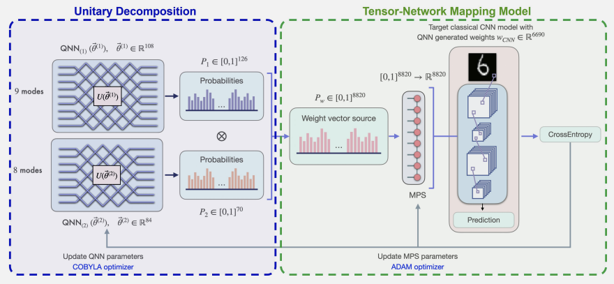
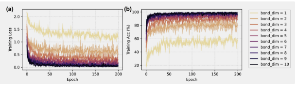
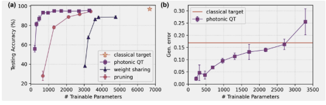
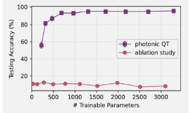
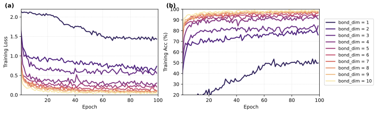
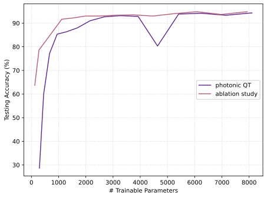

# Distributed Quantum Neural Networks on Distributed Photonic Quantum Computing (DQNN)

## Reference and Attribution

- Paper: Distributed Quantum Neural Networks on
Distributed Photonic Quantum Computing (2025)
- Authors: Chen *et al.*
- DOI/ArXiv: [2505.08474v1](https://arxiv.org/html/2505.08474v1)
- [Original repository](https://github.com/Louisanity/PhotonicQuantumTrain)

We used the code of Jacob Miller the [TorchMPS repository](https://github.com/jemisjoky/TorchMPS).

## Overview

### 🎯 Main goal 
>Classify the reduced MNIST dataset still containing the full 10 digits while reducing the number of parameters to train.

### Main result

>“By leveraging universal linear-optical interferometers ([…]) and matrix product state (MPS) mapping, our framework achieves 10× parameter compression (χ = 4) with only 3.50% relative accuracy loss on MNIST classification (93.29% ± 0.62% vs classical 96.89% ± 0.31%)“. Here the MNIST subset that was used was generated as part of Quandela's Perceval Challenge. The repository with the data and all other submissions can be found [here](https://github.com/Quandela/HybridAIQuantum-Challenge).


### Main contributions of the paper

> - Compared to traditional QML methods, the authors explore a way to use a photonic quantum computer to train the classical parameters of a fully classical neural network model.
> - The main idea driving the project is that fewer quantum parameters need to be trained to obtain all of the classical parameters. That method even less parameters while having better or equal performance compared to classical compression techniques such as pruning and weight sharing.
>- After a noise analysis of the brightness, indistinguishability, second-order correlation and transmittance: “Across all sweeps the worst-case degradation is confined to less than three percentage points, identifying excess multi-photon emission at high brightness as the principal residual error source and demonstrating that the hybrid photonic–classical architecture maintains high-fidelity operation under first-order imperfections realistic for current hardware.”

### Their framework


Source: K.-C. Chen, C.-Y. Liu, Y. Shang, F. Burt, and K. K. Leung, “Distributed Quantum Neural Networks on Distributed Photonic Quantum Computing,” May 13, 2025, arXiv: arXiv:2505.08474. doi: 10.48550/arXiv.2505.08474.


>Here the bond dimension of the MPS, directly impacting its expressivity, is an hyperparameter.
>
>The same alternating input state (|01010101⟩) is used for both interferometers.
>
>The input size of the MPS is $\lceil \log_2m\rceil+1$ where m is the number of classical parameters in the CNN.

### Difference in framework

With MerLin, it is easier to calculate the gradient of a QuantumLayer. So, our implementations allows the user to optimize the boson samplers with Adam instead of COBYLA which can give results of the same precision way faster. In our experiments, we will use the Adam optimizer in both optimizations (the MPS layer and the boson samplers) and it is the one used by default in our implementation. It is still possibile to use COBYLA in our code with a simple parameter change.


### Their results

#### Simple Classical CNN
| \# of training parameters | Training accuracy (%) |Testing accuracy (%)|Generalization error |
| ----------- | ----------- |----------- |----------- |
| 6690      | 99.983± 0.02       | 96.890±0,31      | 0.1690±0.005       |

#### Full QT framework varying the bond lenght (χ)

Source: K.-C. Chen, C.-Y. Liu, Y. Shang, F. Burt, and K. K. Leung, “Distributed Quantum Neural Networks on Distributed Photonic Quantum Computing,” May 13, 2025, arXiv: arXiv:2505.08474. doi: 10.48550/arXiv.2505.08474.

| Bond dimension| \# of training parameters | Training accuracy (%) |Testing accuracy (%)|Generalization error |
| ----------- | ----------- |----------- |----------- |----------- |
| 1     |223      | 58.256 ± 2.34     | 55.775 ± 3.27       | 0.0219 ± 0.007   |
| 2     | 316      | 83.340 ± 2.77     | 81.375 ± 2.28       | 0.0462 ± 0.032   |
| 3     | 471       | 88.693 ± 1.67      | 87.057 ± 2.66       | 0.0364 ± 0.016    |
| 4     | 688       | 93.916 ± 0.45     | 93.292 ± 0.62       | 0.0679 ± 0.002    |
| 5     | 967       | 95.450 ± 0.39     | 93.042 ± 0.77       | 0.0950 ± 0.010    |
| 6     | 1308     | 96.953 ± 0.02     | 94.917 ± 0.60       | 0.1135 ± 0.013    |
| 7     | 1711      | 97.773 ± 0.22     | 94.957 ± 0.82       | 0.1315 ± 0.031   |
| 8     | 2176       | 97.866 ± 0.78      | 94.707 ± 0.4       | 0.1399 ± 0.007   |
| 9     | 2703       | 98.373 ± 0.12      | 94.835 ± 0.4       | 0.1624 ± 0.021    |
| 10     | 3292       | 98.990 ± 0.34     | 95.502 ± 0.84      | 0.2552 ± 0.053    |

Here, 5 classical and quantum epochs for each of the 200 training rounds were used. For each of those quantum epochs 1000 iterations of the COBYLA optimizer were done.

#### Comparing QPT with classical compressing methods

Source: K.-C. Chen, C.-Y. Liu, Y. Shang, F. Burt, and K. K. Leung, “Distributed Quantum Neural Networks on Distributed Photonic Quantum Computing,” May 13, 2025, arXiv: arXiv:2505.08474. doi: 10.48550/arXiv.2505.08474.

|Method| \# of training parameters |Testing accuracy (%)
| ----------- | ----------- |----------- |
| Original      | 6690       | 96.890 ± 0.31      | 
| Weight sharing      | 4770       | 88.666 ± 1.207      | 
| Pruning      | 3770      | 94.443 ± 0.923      | 
| Photonic QT (χ=10)      | 3292       | 95.502 ± 0.84      | 
| Photonic QT (χ=4)     | 688      | 93.292 ± 0.62      | 

#### Ablation analysis

Source: K.-C. Chen, C.-Y. Liu, Y. Shang, F. Burt, and K. K. Leung, “Distributed Quantum Neural Networks on Distributed Photonic Quantum Computing,” May 13, 2025, arXiv: arXiv:2505.08474. doi: 10.48550/arXiv.2505.08474.

>Here they replaced the quantum layer with a random weight generator as input to the MPS.
>>Although, we observed that a new random vector is generated making the previous graph not a real ablation analysis since the MPS can not be trained with constantly changing completely random inputs.

### Our results

#### Full QT framework varying the bond lenght (χ)
Our results are pretty similar to the ones observed in the paper after only one run.



Here only 100 iterations of training of 5 classical and quantum epochs per iteration were used. By each of those quantum epochs 30 steps of the ADAM optimizer were done. We obtain the same tendencies in a shorter experimentation time due ti the optimization of the backend of Merlin and its use of autograd. The bond dimension of 1 seems to give out worse results but the other ones follow the same standard.

#### Ablation analysis



As mentioned before, we identified a potential issue in the authors’ implementation: in their ablation setup, new random values appear to be generated at every training epoch. In our revised ablation protocol, we instead generate the random numbers once per run and keep them fixed throughout training. Under this setting, we obtain results that are comparable to those achieved with the boson sampler. This suggests that the reported benefit of the quantum component may be sensitive to this implementation choice and should be interpreted with caution as the MPS could be responsible for these results more than the quantum part.


## How to Run

### Install dependencies

```bash
python -m venv .venv
source .venv/bin/activate
pip install -r requirements.txt
```

### Command-line interface

Main entry point: the paper-level `lib/runner.py`. The CLI is entirely described in `cli.json`, so updating/adding arguments does not require editing Python code.

```bash
# From inside papers/reproduction_template
python l../../implementation.py  --help

# From the repo root
python implementation.py --paper DQNN --help
```

Example overrides (see `cli.json` for the authoritative list):

- `--config CONFIG_NAME` Load an additional JSON config (merged over `defaults.json`). The config path is automatically handled by the code.

Example runs:

```bash
# From a JSON config (inside the project)
python ../../implementation.py  --config configs/defaults.json

# Override some parameters inline
python ../../implementation.py  --config configs/defaults.json --num_training_rounds 50 

# Equivalent from the repo root
python implementation.py --paper DQNN --config configs/defaults.json --num_training_rounds 50
```

## Project structure
- `papers.DQNN.lib/runner.py` — The file to run for every experiment.
- `papers.DQNN.lib/` — core papers.DQNN.library modules used by scripts.
  - `torchmps/` — Repository to instanciate a MPS tensor module in Torch.
  - `ablation_exp.py`, `bond_dimension_exp.py`, `default_exp.py`- Files containing the function to run the corresponding experiment.
  - `boson_sampler.py` - The file containg the class managing the quantum layers.
  - `classical_utils.py`, `photonic_qt_utils.py` - Files containing utility functions.
  - `model.py` — The torch module implementing the quantum train algorithm.
- `configs/` — Experiment configs + CLI schema consumed by the shared runner. The available ones are below.
  - `defaults.json`, `cli.json`, `bond_dim_exp.json`, `ablation_exp.json`
- Other
  - `requirements.txt` — Python dependencies.
  - `tests/` - Unitary tests to make sure the papers.DQNN.library works correctly.
  - `utils/` — Containing the `utils.py` file used for plotting and repo utility functions.

## Results and Analysis

- The results are stored in the [results](results/) folder. Logs and figures will be saved in the [outdir](outdir/) directory.
- To reproduce the experiments, simply call these lines at the paper level:
 
 For just a basic training and evaluation:
 >``python3 ../../implementation.py  --config defaults.json``

 For a analysis of the relation between accuracy and the bond dimension of the MPS:
 >``python3 ../../implementation.py  --config bond_dim_exp.json``

  For an ablation study:
 >``python3 ../../implementation.py  --config ablation_exp.json``


## Extensions and Next Steps

- Generalize the model to train any neural network model. To start, maybe adapt the code for a CNN of various sizes.

- Further analyze the pertinence of the quantum layer in the model.

## Testing

Run tests from inside the `papers/DQNN/` directory:

```bash
cd papers/DQNN
pytest -q
```
Notes:
- Tests are scoped to this template folder and expect the current working directory to be `DQNN/`.
- If `pytest` is not installed: `pip install pytest`.

## Acknowledgments
We here used the code of Jacob Miller the [TorchMPS repository](https://github.com/jemisjoky/TorchMPS).