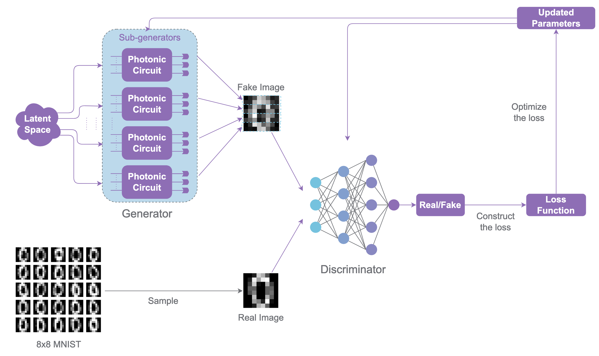

# Photonic Quantum Generative Adversarial Networks for classical data

## IMPORTANT: only in Perceval for now

## Reference and Attribution

- Paper: Photonic quantum generative adversarial networks for classical data (Optica Quantum, 2025)
- Authors: Tigran Sedrakyan, Alexia Salavrakos
- DOI/ArXiv: https://arxiv.org/abs/2405.06023
- Original repository: https://github.com/Quandela/photonic-qgan
- License and attribution notes: to complete


## Overview

"In generative learning, models are trained to produce new samples that follow the distribution of the target data. These models were historically difficult to train, until proposals such as Generative Adversarial Networks (GANs) emerged, where a generative and a discriminative model compete against each other in a minimax game. Quantum versions of the algorithm were since designed, both for the generation of classical and quantum data. While most work so far has focused on qubit-based architectures, in this article we present a quantum GAN based on linear optical circuits and Fock-space encoding, which makes it compatible with near-term photonic quantum computing. We demonstrate that the model can learn to generate images by training the model end-to-end experimentally on a single-photon quantum processor." [Original abstract of the [paper](https://opg.optica.org/opticaq/fulltext.cfm?uri=opticaq-2-6-458)]



## Project layout

# Project Layout
```
.
├── README.md                                    # Overview, layout, and run commands
├── requirements.txt                             # Python dependencies
├── photonicQGAN.png                             # Figure for overview section
├── __init__.py                                  # Package marker
│
├── configs/
│   ├── cli.json                                 # CLI schema for runtime runner
│   └── defaults.json                            # Default configuration for runs
│
├── lib/
│   ├── __init__.py                              # Package marker
│   ├── runner.py                                # Runtime entrypoint and training loop
│   ├── qgan.py                                  # QGAN model wrapper
│   ├── generators.py                            # Classical and photonic patch generators
│   ├── discriminator.py                         # Discriminator network
│   └── classical_generator.dict                 # Serialized classical generator state
│
├── utils/
│   ├── __init__.py                              # Package marker
│   ├── mappings.py                              # Output mapping utilities for photonic states
│   ├── pqc.py                                   # Parametrized photonic quantum circuit helpers
│   ├── spsa.py                                  # SPSA optimizer implementation
│   └── visualize.py                             # Visualization helpers for training artifacts
│
├── notebooks/
│   ├── qgan_digits.ipynb                        # Digits-mode notebook run
│   ├── qgan_ideal.ipynb                         # Ideal-mode notebook run
│   ├── qgan_noisy.ipynb                         # Noisy-mode notebook run
│   ├── classical_gan.ipynb                      # Baseline classical GAN notebook
│   ├── analyse.ipynb                            # Analysis notebook for results
│   ├── parse_results_digits.ipynb               # Parsing/plotting for digits runs
│   ├── parse_results_ideal.ipynb                # Parsing/plotting for ideal runs
│   ├── parse_results_noisy.ipynb                # Parsing/plotting for noisy runs
│   └── qpu/
│       ├── config.json                          # Stored QPU config example
│       ├── fake_progress.csv                    # Sample generated data for QPU run
│       ├── loss_progress.csv                    # Sample loss curves for QPU run
│       └── G_params_progress.csv                # Sample generator parameters for QPU run
│
├── tests/
│   ├── common.py                                # Shared test utilities
│   ├── test_cli.py                              # CLI smoke tests
│   └── test_smoke.py                            # Basic run wiring smoke test
│
├── outdir/                                      # Generated run artifacts (logs, configs, CSVs, images)
├── results/                                     # Generated run artifacts (logs, configs, CSVs, images)
│
└── ../                                          # Parent directory
    ├── data/photonic_QGAN/
    │   └── optdigits_csv.csv                    # Dataset CSV
    └── papers/shared/photonic_QGAN/
        └── digits.py                            # Shared dataset utilities
```

## Modes

- `smoke`: quick placeholder run that writes a `done.txt` marker (no training, for test purposes).
- `digits`: trains on digit subsets from the Optdigits CSV; uses the `digits` config block
  (`arch`, `noise_dim`, `input_state`, `gen_count`, `pnr`) and the digit selection
  (`digits` list or `digit_start`/`digit_end`).
- `ideal`: sweeps a grid of generator configs (no digit filtering). The grid comes from
  `ideal.use_default_grid` or a JSON list at `ideal.config_grid_path`; each config is saved
  under `results/.../ideal/config_<n>/config.json`.

## MerlinQuantum migration notes

A few notes to migrate this project to MerlinQuantum, the following steps are reasonable (but these are just advices, there may be other ways):

- Replace `PatchGenerator` with a `MerLin.QuantumLayer`-based module.
  - Option A: translate the Perceval circuit directly into a `QuantumLayer` object (if a direct importer exists).
  - Option B: rebuild the architecture with the builder API and map the current `arch` list to that builder.
- Remark: SLOS is the built-in back-end of MerLin
- Swap the SPSA optimizer for a standard `torch.optim` optimizer (Adam/SGD), since the MerlinQuantum layer is differentiable [Note: it could be pertinent to compare both training]
- Keep the discriminator unchanged; only the generator training path and parameter update logic should change.
- Update config/schema to reflect the new generator backend (e.g., `generator_backend: perceval|merlin`).
- Save the models at the end of training using PyTorch built-in state_dict method

## Running

The shared runner is wired for a lightweight smoke run (placeholder artifact). Use the
notebooks for full reproduction until the training pipeline is migrated.

```bash
python implementation.py --paper photonic_QGAN --config configs/defaults.json
```

To run the original training loops from the notebooks in batch mode, use:

```bash
python implementation.py --paper photonic_QGAN --config configs/defaults.json --mode digits
python implementation.py --paper photonic_QGAN --config configs/defaults.json --mode ideal
```
