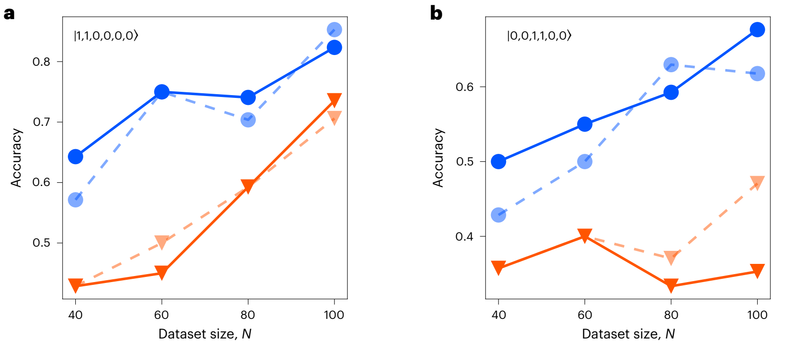
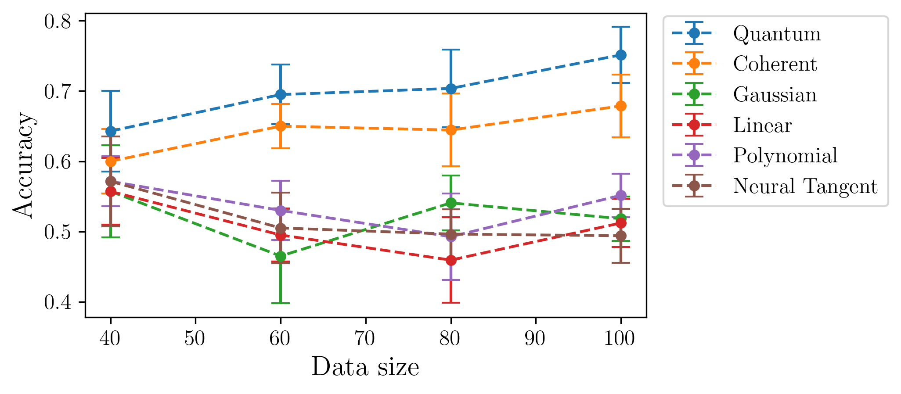
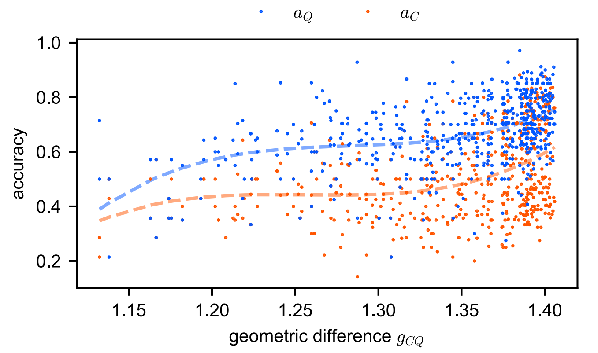
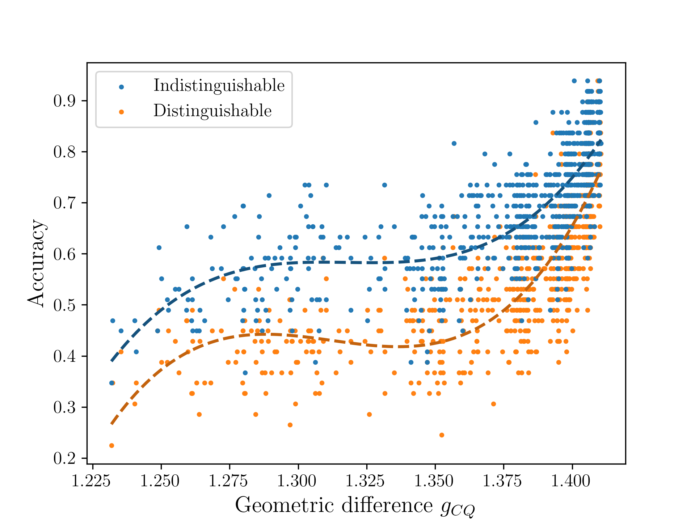
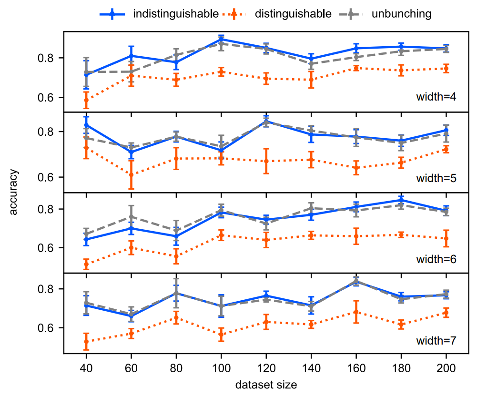

# Experimental quantum-enhanced kernel-based machine learning on a photonic processor

## Reference and Attribution

- Paper: Experimental quantum-enhanced kernels on a photonic processor (Nature Photonics, 2025)
- Authors: Zhenghao Yin, Iris Agresti, Giovanni de Felice, Douglas Brown, Alexis Toumi, Ciro Pentangelo, Simone
Piacentini, Andrea Crespi, Francesco Ceccarelli, Roberto Osellame, Bob Coecke and Philip Walther.
- DOI/ArXiv: https://www.nature.com/articles/s41566-025-01682-5, https://arxiv.org/abs/2407.20364
- Original repository: https://github.com/dapingQ/PhoQuKs

## Overview

Quantum kernel methods resolve non-linear relationships by projecting data to higher
dimensional spaces. The source paper demonstrates a quantum kernel method by
estimating the transition probability of a given input Fock state, $|\mathbf{s}\rangle$,
through a parametrized interferometer $U^{\dagger}(x_2) U(x_1)$.

$$
\kappa(x_1, x_2) = |\langle\mathbf{s}|U^{\dagger}(x_2) U(x_1) | \mathbf{s} \rangle|^2
$$

The paper considers two types of kernels (indistinguishable and distinguishable
photons). The dataset is ad-hoc such that the indistinguishable kernel outperforms the
kernel with distinguishable photons

## How to Run

### Install dependencies

```bash
python -m venv .venv
source .venv/bin/activate
pip install -r requirements.txt
```

### Command-line interface

Main entry point: the repo-level `implementation.py`. The CLI is described in
`configs/cli.json`.

```bash
# From inside papers/photonic_quantum_enhanced_kernels
python ../../implementation.py --help

# From the repo root
python implementation.py --paper photonic_quantum_enhanced_kernels --help
```

Example runs:

```bash
# Run default experiment (accuracy_vs_kernel.py)
python ../../implementation.py --paper photonic_quantum_enhanced_kernels

# Run a specific experiment
python ../../implementation.py --paper photonic_quantum_enhanced_kernels --experiment accuracy_vs_kernel

# Use the small example config
python ../../implementation.py --paper photonic_quantum_enhanced_kernels --config configs/accuracy_vs_kernel.json
```

Available flags (by experiment):

- Shared flags (all experiments):
    - `--experiment`
    - ` --config`,
    - `--outdir`,
    - `--use-tex`,
    - `--dry-run`,
    - `--log-level`,
    - `--device`,
    - `--dtype`,
- accuracy_vs_kernel:
    - `--reg`
    - `--test-size`
    - `--seed`
    - `--shots`,
    - `--no-bunching`,
    - `--force-psd`,
    - `--indistinguishability`,
    - `--superset-size`,
    - `--reps`,
    - `--data-sizes`,
    - `--input-state`
- accuracy_vs_input_state:
    - `--reg`
    - `--test-size`
    - `--seed`
    - `--shots`
    - `--no-bunching`
    - `--force-psd`
    - `--indistinguishability`
    - `--superset-size`
    - `--reps`
    - `--data-sizes`
    - `--input-states`
- accuracy_vs_width:
    - `--reg`
    - `--test-size`
    - `--seed`
    - `--superset-size`
    - `--reps`
    - `--data-sizes`
    - `--widths`
- accuracy_vs_geometric_difference:
    - `--reg`
    - `--test-size`
    - `--seed`
    - `--num-points`
    - `--n`
    - `--data-size`
    - `--m-min`
    - `--m-max`
    - `--spline-smoothing`

### Output directory and generated files

Each run writes artifacts under a timestamped folder:

```
outdir/run_YYYYMMDD-HHMMSS/
├── config_snapshot.json
├── summary.json
└── accuracy_vs_kernel/
    ├── data.npz
    ├── hyperparameters.json
    └── plot.png
```

Reference plots tracked in the repository remain under `results/`.

## Configuration

Configuration files live in `configs/`:

- `defaults.json` defines defaults for all experiments.
- `cli.json` declares the CLI arguments and which config keys they update.
- `example.json` provides a smaller run for sanity checking.

## Structure

```bash
photonic_quantum_enhanced_kernels/
│
├── configs/
│   ├── cli.json
│   ├── defaults.json
│   └── example.json
│
├── figures/ # Source paper figures.
│
├── lib/ # Reproduction code and runtime entrypoint.
│   ├── runner.py
│   ├── accuracy_vs_geometric_difference.py
│   ├── accuracy_vs_input_state.py
│   ├── accuracy_vs_kernel.py
│   └── accuracy_vs_width.py
│
├── results/
│
├── utils / # Utility source files
│   ├── feature_map.py   # Util for constructing quantum kernel feature maps.
│   ├── generate_data.py # Generating ad-hoc dataset.
│   └── noise.py         # Partial distinguishability simulation.
│
├── tests/
│   └── test_noise.py
└── README.md
```

## Results

The plots from the original source paper are arranged on the left and our
reproductions on the right.

### Figures 4a and 4b

 

### Figure 4c

 

### Supplementary Figure 1
g
 

### Supplementary Figure 2

 

## Testing

This directory contains tests for ensuring that the noise computation in `utils/noise.py` is performed correctly by cross-referencing the probabilities with Perceval.
To run tests:

```bash
pytest -q
```

If `pytest` is not installed: `pip install pytest`.
